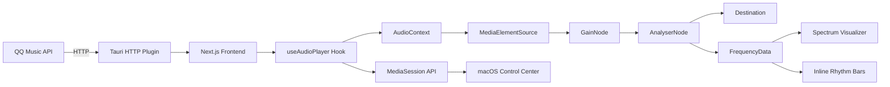

<div align="center">

# 🎵 MusePlayer

**一款精致的跨平台桌面音乐播放器**
**A beautifully crafted cross-platform desktop music player**

[](https://v2.tauri.app)
[](https://nextjs.org)
[](https://react.dev)
[](https://www.rust-lang.org)
[](LICENSE)

<br/>

[中文](#-功能特性) · [English](#-features) · [安装 Installation](#-安装--installation) · [开发 Development](#-开发--development)

</div>

---

## ✨ 功能特性

<table>
<tr>
<td width="50%">

### 🎧 在线播放
- 🔍 全网音乐搜索（QQ 音乐源）
- 📝 实时逐行歌词同步滚动
- 🎨 专辑封面环境光背景动效
- 📊 实时频谱可视化分析器

</td>
<td width="50%">

### 🖥️ 原生体验
- 🍎 macOS 原生标题栏 + 深色模式
- ⌨️ 系统媒体键控制（播放/暂停/上下曲）
- 🔊 Web Audio API GainNode 精确音量控制
- 💾 播放列表与播放进度自动持久化

</td>
</tr>
<tr>
<td>

### 🎵 播放管理
- 📋 播放列表管理（添加/删除/批量操作）
- 🔀 多种播放模式（顺序/随机/单曲循环）
- 🎼 播放中歌曲多彩律动条动效
- 🔔 Toast 气泡通知反馈

</td>
<td>

### 🎨 视觉设计
- 🌈 多彩频谱律动条（6 色渐变动画）
- ✨ macOS 风格弹窗动画（scale + fade）
- 🖼️ 专辑封面提取环境色背景
- 🎭 毛玻璃 + 半透明界面效果

</td>
</tr>
</table>

---

## ✨ Features

<table>
<tr>
<td width="50%">

### 🎧 Online Streaming
- 🔍 Search millions of songs (QQ Music source)
- 📝 Real-time synchronized lyrics scrolling
- 🎨 Ambient background glow from album art
- 📊 Real-time audio spectrum visualizer

</td>
<td width="50%">

### 🖥️ Native Experience
- 🍎 Native macOS title bar with dark theme
- ⌨️ System media key controls (play/pause/prev/next)
- 🔊 Precise volume via Web Audio API GainNode
- 💾 Auto-persist playlist & playback progress

</td>
</tr>
<tr>
<td>

### 🎵 Playback Management
- 📋 Playlist management (add/remove/batch)
- 🔀 Multiple play modes (sequential/shuffle/repeat-one)
- 🎼 Multi-color rhythm bars on the playing track
- 🔔 Toast notifications for user feedback

</td>
<td>

### 🎨 Visual Design
- 🌈 Multi-color spectrum bars (6-color gradient)
- ✨ macOS-style modal animation (scale + fade)
- 🖼️ Dominant color extraction from album covers
- 🎭 Frosted glass + translucent UI effects

</td>
</tr>
</table>

---

## 🏗️ 技术栈 / Tech Stack

```
┌─────────────────────────────────────────────────┐
│                   Tauri v2                       │
│  ┌───────────────────────────────────────────┐   │
│  │            Next.js 16 (Turbopack)         │   │
│  │  ┌─────────────┐  ┌───────────────────┐   │   │
│  │  │  React 19   │  │  Tailwind CSS 4   │   │   │
│  │  └─────────────┘  └───────────────────┘   │   │
│  │  ┌─────────────┐  ┌───────────────────┐   │   │
│  │  │ Web Audio   │  │  Radix UI         │   │   │
│  │  │ API Engine  │  │  Components       │   │   │
│  │  └─────────────┘  └───────────────────┘   │   │
│  └───────────────────────────────────────────┘   │
│  ┌───────────────────────────────────────────┐   │
│  │         Rust Backend (Wry/WebView)        │   │
│  └───────────────────────────────────────────┘   │
└─────────────────────────────────────────────────┘
```

| Layer     | Technology                          |
|-----------|-------------------------------------|
| Frontend  | React 19 · Next.js 16 · TypeScript  |
| Styling   | Tailwind CSS 4 · Radix UI           |
| Audio     | Web Audio API · AudioContext · GainNode |
| Desktop   | Tauri v2 · Rust · Wry WebView       |
| Build     | Turbopack · Cargo · GitHub Actions   |

---

## 📦 安装 / Installation

### 📥 下载安装包 / Download Releases

从 [Releases](../../releases) 页面下载对应平台的安装包：

| 平台 Platform     | 文件 File                | 架构 Arch       |
|-------------------|--------------------------|------------------|
| 🍎 macOS          | `音乐播放器_x.x.x.dmg`   | Apple Silicon / Intel |
| 🪟 Windows        | `音乐播放器_x.x.x.msi`   | x64              |
| 🪟 Windows        | `音乐播放器_x.x.x.exe`   | x64 (NSIS)       |

### 🔨 从源码构建 / Build from Source

**前置要求 / Prerequisites:**
- [Node.js](https://nodejs.org) ≥ 20
- [Rust](https://rustup.rs) ≥ 1.77
- macOS: Xcode Command Line Tools
- Windows: [Visual Studio Build Tools](https://visualstudio.microsoft.com/visual-cpp-build-tools/) (C++ 桌面开发)

```bash
# 克隆仓库 / Clone
git clone https://github.com/your-username/app-music.git
cd app-music

# 安装依赖 / Install dependencies
npm install

# 开发模式 / Development
npx tauri dev

# 生产构建 / Production build
npx tauri build
```

---

## 🛠️ 开发 / Development

### 项目结构 / Project Structure

```
app-music/
├── app/                    # Next.js 页面路由
│   ├── layout.tsx          # 根布局
│   └── page.tsx            # 主页面
├── components/             # React 组件
│   ├── music-player.tsx    # 🎵 主播放器容器
│   ├── player-controls.tsx # 🎛️ 底部播放控制栏
│   ├── track-list.tsx      # 📋 播放列表 + 律动条
│   ├── search-panel.tsx    # 🔍 搜索弹窗
│   ├── lyrics-scroller.tsx # 📝 歌词滚动器
│   ├── audio-visualizer.tsx# 📊 频谱可视化
│   ├── album-artwork.tsx   # 🖼️ 专辑封面
│   └── ui/                 # Radix UI 基础组件
├── hooks/                  # 自定义 Hooks
│   ├── use-audio-player.ts # 🔊 音频引擎 (AudioContext)
│   ├── use-online-music.ts # 🌐 QQ Music API 集成
│   └── use-image-colors.ts # 🎨 封面颜色提取
├── src-tauri/              # Tauri / Rust 后端
│   ├── src/
│   ├── Cargo.toml
│   └── tauri.conf.json
└── .github/workflows/      # CI/CD
    └── build.yml           # 跨平台自动构建
```

### 常用命令 / Commands

```bash
# 启动开发服务器（带热更新）
npm run dev

# Tauri 开发模式（前端 + 原生窗口）
npx tauri dev

# 构建生产版本
npx tauri build

# 代码检查
npm run lint
```

---

## 🔧 核心架构 / Core Architecture



---

## 🚀 CI/CD

本项目使用 GitHub Actions 实现自动化跨平台构建：

- **手动触发**：在 Actions 面板点击 `Run workflow`
- **Tag 触发**：推送 `v*` 标签自动构建并创建 Release

```bash
# 创建版本并触发构建
git tag v0.1.0
git push origin v0.1.0
```

支持的构建目标：
- `aarch64-apple-darwin` — macOS Apple Silicon
- `x86_64-apple-darwin` — macOS Intel
- `x86_64-pc-windows-msvc` — Windows x64

---

## 📄 License

[MIT](LICENSE) © 2026

---

<div align="center">

**用 ❤️ 和 🎵 构建 / Built with ❤️ and 🎵**

如果觉得这个项目不错，请给一个 ⭐️
If you like this project, please give it a ⭐️

</div>
